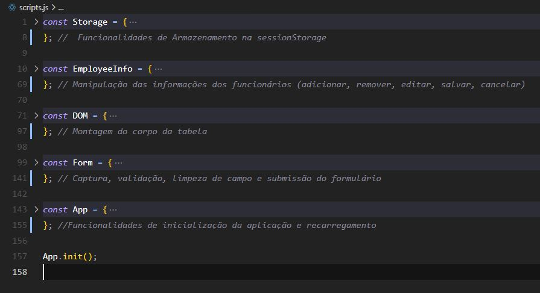

#### Olá, sejam bem vindos!

<h2 align="center"> OBUC Front-End Challenge</h2>

 💻 Você pode visualizar a página criada no githubPages clicando AQUI.

 <h3> ℹ️ Informações gerais sobre a criação do projeto: </h3> 

◽ Linguagens utilizadas: HTML, Css e JavaScript puro ;  
◽ Os ícones foram retirados da biblioteca do fontawsome ;  
◽ As informações da lista foram armazenadas na sessionStorage do navegador em um array chamado "arrLocaisTrabalho";  
 

 <h3> ℹ️ Informações sobre a organização do arquivo script.js: </h3> 

◽ As diferentes funcionalidades/métodos criados, foram dispostos em diferentes objetos. A ordem desses objetos bem como
suas funções, são mostradas na figura abaixo:

 
 
 

 Obrigado pela visita! Críticas e sugestões são muito bem vindas.
  

 Atenciosamente, José Mauricio Azevedo Ferreira 

